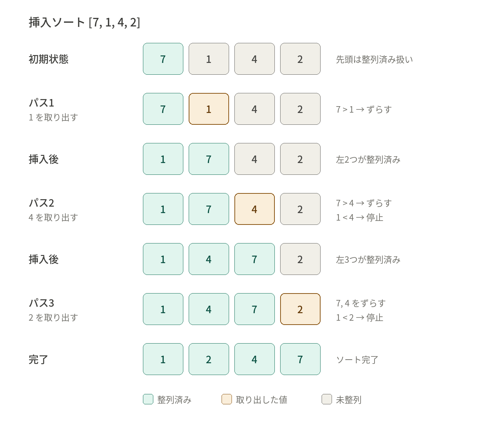

# 挿入ソート

## 概要

挿入ソート

---

## 前提知識

なし

---

## 本文

### しくみ
ソート済みと未ソートに分けることがポイント。
未ソートの要素をソート済みの間に入れるのはok。

1. 先頭の要素を他の要素と比較し並べ替える。ソート済みとする。
2. 未ソートの先頭要素を並べ替えて、ソート済みとする。
3. 2を繰り返す

ほぼ整列済みの場合、O(n)に近いが
降順に並んでいる場合、O(n^2)に近くなる。
